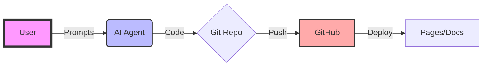

<!-- _class: lead -->

# AI-Teachathon 🧬
### Halbritter Lab / CeRKiD

Please open this file in **VS Code** with the `Marp` extension to view as a presentation.
Or simply read on for documentation.

v1.0 Planning Phase

---

## 🎯 **The Goal**

> To empower the lab with **AI-assisted coding tools**, **Git**, and **GitHub** skills through a hands-on hackathon.

**Why?**
*   🧬 **Reproducibility**: No more `final_v3.docx`.
*   🤖 **Acceleration**: AI writes the boilerplate; you do the science.
*   🌍 **Collaboration**: Open source your research tools.

---

## 🗺️ **The Landscape**

---

## 📅 **Agenda**

1.  **[Setup & Prep](../setup.md)** Pre-req
    *   Install VS Code, Git, GitHub Account.
2.  **Theory (30m)**
    *   Presentation: "Why Version Control?"
    *   Tool Landscape: ChatGPT vs. Claude vs. Agents.
3.  **[Hands-On](../hands-on.md)** 2 Hours
    *   Project: **KidneyQuest** (Zebra needs to collect genes!).
    *   Activity: Clone -> Branch -> Prompt -> PR -> Merge.

---

<!-- _class: doc -->

## 📚 **Documentation & Resources**

This section is detailed documentation intended effectively as a "handout" or reference guide.

### 📂 **Project Structure**

| File | Purpose |
| :--- | :--- |
| `index.md` | The landing page for the Teachathon site. |
| `setup.md` | Instructions for participants to prepare their laptops. |
| `agenda.md` | The schedule for the workshop. |
| `hands-on.md` | The guide for the **KidneyQuest** session. |
| `presentation.html` | The Reveal.js slide deck for the intro talk. |

<strong>Click to see original prompt content</strong>

The original prompt used to generate this structure has been archived to `start_original_prompt.md`.
You can view it [here](../.planning/start_original_prompt.md).

---

<!-- _class: doc -->

## 🛠️ **Tools We Use**

*   **VS Code**: The editor.
*   **Git**: The time machine.
*   **GitHub**: The collaboration hub.
*   **Claude Code / Copilot**: The AI pair programmer.

### 💡 **Quick Tips**
1.  **Commit often**: Like saving a game before a boss fight.
2.  **Write clear prompts**: "Make the zebra jump" vs "Add a physics-based jump mechanic with gravity 9.8".
3.  **Review AI code**: It hallucinates. You are the pilot.

---

<!-- _class: lead -->

# 🚀 **Let's Start!**

[Open Agenda](../agenda.md) | [Open KidneyQuest Repo](https://github.com/berntpopp/KidneyQuest)

---
