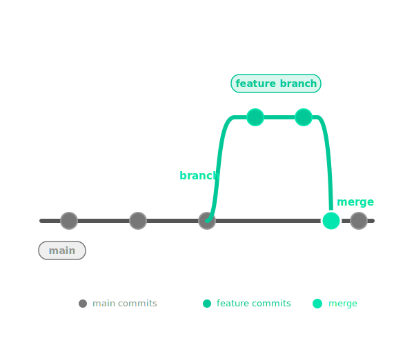
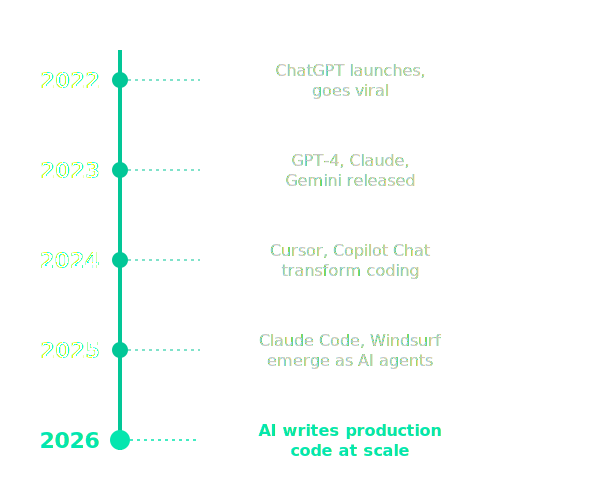
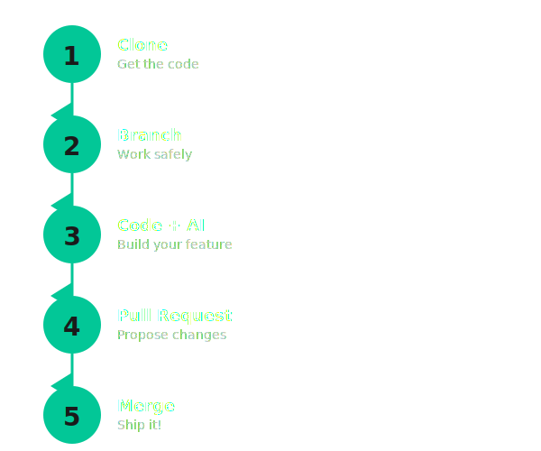

<!-- _class: lead -->
<!-- _paginate: false -->

# Git, GitHub and AI Tools

AI-Teachathon | Halbritter Lab / CeRKiD
February 17, 2026

<!-- Welcome everyone. We're going to spend the next 30 minutes talking about version control, AI tools, and why they work so well together. Then we'll jump into hands-on coding. -->

---

# What You'll Learn Today

By the end of this session, you'll be able to:

- **Understand** Git basics: repos, commits, branches, and PRs
- **Protect** your research: .gitignore, private repos, and PII management
- **Explain** why version control is essential when using AI tools
- **Navigate** the AI tool landscape and choose what fits your workflow
- **Follow** the complete Git workflow hands-on with KidneyQuest

<!-- This primes the audience for what matters. Keep to 5 objectives max. Use action verbs. Revisit these at the end to close the loop. -->

---

# We've All Been Here

final_v3.docx
final_v3_REALLY_final.docx
final_v3_REALLY_final_reviewed.docx
final_v3_REALLY_final_reviewed_comments_addressed.docx

<!-- ENGAGEMENT: Show of hands - who has more than 5 versions of a file right now? [Pause for laughter/recognition] This is the traditional approach to version control. You know this system. It works until it doesn't. The problem: which version has the correct analysis? Which one did you send to the collaborator? -->

---

# Version Control Unlocks AI's Potential

- And it's not just about avoiding filename chaos
- It's the foundation for working effectively with AI
- Version control lets you experiment, fail safely, and iterate fast

<!-- That's the hook. Version control is how you unlock AI's potential. You need to track what the AI changed, roll back when it makes mistakes, and maintain a clear history of your project. -->

---

# Reproducibility Requires Version Control

**Scenario:** You need to reproduce results from 6 months ago.

- Which version of the script did you use?
- What were the exact parameters?
- Which dataset version?

**Without version control:** Good luck.
**With version control:** `git checkout` and you're there.

<!-- This is not hypothetical. Reviewers ask for this. Reproducibility is essential. Version control makes it possible. -->

---

<!-- _paginate: false -->
<!-- _class: lead section-git -->

# <!-- fit --> Part 1: Git Basics

Your foundation for version control

---

# A Repository Tracks Your Entire Project History

Think of it as a **lab notebook for your code**.

- Every change is tracked automatically
- You can see who changed what and when
- You can jump back to any previous state

A repository (or "repo") is just a folder with a `.git` directory that stores the history.

<!-- From here on, we use real terms, not research analogies. A repo is a folder with history. That's it. -->

---

# Every Commit Is a Safe Restore Point

- A **commit** is a save point
- It captures the exact state of all files at that moment
- Each commit has a unique ID and a message describing what changed

Think of commits as save points in a game. You can always go back.

<!-- Commits are the building blocks of Git. You make changes, stage them, commit them with a message. Simple. -->

---

# Good Commit Messages Tell Your Project's Story

**Bad commit message:**
"fixed stuff"

**Good commit message:**
"fix: correct gene ID validation to handle ENSG format"

- Commit messages tell the story of your project
- They help you (and others) understand what changed and why
- Write them for your future self

<!-- You'll thank yourself later. Trust me. -->

---

# Conventional Commits Make History Machine-Readable

**Format:** `type(scope): description`

**Common types:**
- `feat:` - New feature
- `fix:` - Bug fix
- `docs:` - Documentation
- `refactor:` - Code restructure
- `test:` - Tests

**Example:** `feat: add gene search filter`

<!-- This builds on the previous slide. KidneyQuest uses this format. It enables automated changelogs and clear history. Show a real example from the repo's git log if possible. -->

---

# Semantic Versioning Tells You What Changed

**v1.2.3 means:**
- **1** (MAJOR) - Breaking changes
- **2** (MINOR) - New features, backward compatible
- **3** (PATCH) - Bug fixes

**Why researchers care:** Reproducibility
- Cite specific versions in papers
- Know when updates break things

<!-- Bumping from v1.x to v2.0 means "this may break your analysis." Link back to conventional commits: feat bumps MINOR, fix bumps PATCH. -->

---

# Private Repos Protect Unpublished Research

**Public repositories:**
- Anyone can view, clone, and contribute
- Good for: Open source, teaching, published tools

**Private repositories:**
- Restricted access only
- Good for: Unpublished research, patient-adjacent data, pre-publication code

**Default for medical research:** Start private, make public when ready

<!-- Charite context: most research should be private until publication. GitHub gives you unlimited private repos for free. -->

---

# .gitignore Prevents Accidents Before They Happen

**What it is:** A file telling Git which files to never track

**What to ignore:**
- Large data (CSVs, FASTQs, imaging)
- Environment files (.env, API keys)
- Binary files (PDFs, compiled code)
- OS artifacts (.DS_Store, Thumbs.db)

**Why it matters:** Prevents accidental commits of things that should never be in a repo

<!-- .gitignore is your first line of defense. Use GitHub's templates for your language. Prevention is easier than cleanup. -->

---

# Never Commit Patient Data or Credentials

**The rules:**
- No patient data, even "anonymized"
- No API keys, passwords, or tokens
- No institutional credentials

**What if you do?** It's in the history forever. Rewriting history is painful.

**Best practice:** Always review diffs before committing

<!-- For medical research, this is non-negotiable. Prevention is everything. A single accidental commit of patient data can be a serious compliance issue. -->

---

<!-- _class: lead -->

# If you accidentally commit a password to GitHub, can you just delete the file?

<!-- Give 10 seconds of silence. Then explain: No - it's in the history forever. Even if you delete the file in a new commit, the old commit still has it. This is why .gitignore and reviewing diffs matters. Prevention is everything. This reinforces the previous 3 slides. -->

---

# Branches Let You Experiment Without Risk

- A **branch** is like running a parallel experiment
- The main branch stays safe and stable
- You work on your branch, test your changes, then merge when ready

**Example:**
- `main` branch: the stable version
- `add-visualization` branch: your new feature

<!-- This is the second and last research analogy. After this, we use real terms. Branches let you try things without breaking the main project. -->

---

# Pull Requests Are Where Collaboration Happens

- You've finished work on your branch
- Now you want to merge it into `main`
- You open a **pull request** (PR)

**What happens:**
- Someone reviews your code
- You discuss, make changes if needed
- Once approved, you merge

This is how teams collaborate.

<!-- PRs are where collaboration happens. Code review. Discussion. Then merge. This is the workflow you'll follow today. -->

---

# Git Is Local, GitHub Is Online

**Git:**
- The version control tool on your computer
- Tracks changes, creates commits, manages branches
- Works offline

**GitHub:**
- A website for hosting Git repositories
- Enables collaboration, pull requests, issue tracking
- Where you share your code

<!-- ENGAGEMENT: Quick check - "If your laptop dies right now, is your Git history lost? What about your GitHub repos?" [Pause for 2-3 responses. Answer: Git is local (lost if not pushed), GitHub is remote (safe).] Brief, clear distinction. Git is the tool. GitHub is the platform. You need both. -->

---

<!-- _paginate: false -->
<!-- _class: lead section-ai -->

# <!-- fit --> Part 2: Version Control in the AI Era

Why Git matters more when AI writes your code

---

# AI Is Fast - Version Control Keeps You Safe

- AI tools can write hundreds of lines of code in seconds
- You need to track what changed and why
- You need to review AI-generated code carefully

**Version control gives you:**
- A clear history of what the AI added
- The ability to roll back if something breaks
- Confidence to try bold experiments

<!-- AI is powerful but not perfect. Version control is your safety net. -->

---

# Experiment Freely, Fail Safely

- AI makes suggestions. Some are great. Some are wrong.
- With version control, you can try anything
- If it doesn't work, `git reset` and you're back to safety

**The combination: Git + AI = you can be bold**

<!-- This is the key insight. Version control unlocks AI's potential because you can experiment without fear. -->

---

# AI Coding Tools Evolved Rapidly Since 2022

- **November 2022:** ChatGPT launches, goes viral
- **2022-2023:** GitHub Copilot gains adoption
- **2023:** GPT-4, Claude, Gemini released
- **2024-2025:** Cursor, Claude Code, Windsurf emerge
- **2026:** AI writes significant portions of production code

**The pace is accelerating. That's why we're here today.**

<!-- ENGAGEMENT: Show of hands - who has used ChatGPT, Copilot, or any AI coding tool before? [Gauge the room's experience level. Adjust depth accordingly.] This is moving fast. Two years ago, GitHub Copilot was cutting edge. Now we have AI agents that write entire features. You need to keep up. -->

---

<!-- _paginate: false -->
<!-- _class: lead section-tools -->

# <!-- fit --> Part 3: The Tool Landscape

Navigate AI coding tools with confidence

---

# Three Categories of AI Coding Tools

**Three categories:**
1. **Chat-based:** ChatGPT, Claude.ai
2. **IDE sidebar:** GitHub Copilot, Cursor
3. **CLI agents:** Claude Code, Codex CLI

Each has strengths. Choose based on your workflow.

<!-- This is the overview. Next slides break down each category. -->

---

# Choose the Tool That Fits Your Workflow

**For today's hands-on session:**
- You can use any tool you prefer
- Chat-based is fine
- Sidebar is fine
- CLI is fine

**No single right answer.** Use what feels comfortable.

<!-- The goal is to learn the workflow, not master a specific tool. Pick what works for you. We'll briefly cover each category next. -->

---

# Chat Tools Are Best for Learning and Quick Questions

**Examples:** ChatGPT, Claude.ai, Gemini

**Good for:**
- Explaining concepts
- Writing small code snippets
- Debugging errors
- Planning architecture

**Limitation:** You copy/paste code manually.

<!-- Chat tools are great for learning and quick questions. Not ideal for writing large codebases because of the copy/paste friction. -->

---

# Sidebar Tools Integrate AI Into Your Editor

**Examples:** GitHub Copilot, Cursor, Cody

**Good for:**
- Autocomplete while you type
- Inline suggestions
- Editing existing code
- Staying in your editor

**Benefit:** Tight integration with your workflow.

<!-- Sidebar tools are the sweet spot for many developers. Suggestions appear as you type. You stay in your editor. This is what most people use daily. -->

---

# CLI Agents Automate Entire Tasks

**Examples:** Claude Code, Codex CLI, Aider

**Good for:**
- Autonomous tasks ("build a login page")
- Multi-file refactoring
- Following complex instructions
- Running terminal commands

**Tradeoff:** Less control, more automation.

<!-- CLI agents are powerful but require trust. They can modify multiple files, run commands, even commit to Git. Advanced users love them. Beginners should start with chat or sidebar. -->

---

# The Course Site Has Everything You Need

**The AI Tools page on the course site has:**
- Detailed comparisons
- Setup instructions for each tool
- Pros and cons
- Recommendations based on experience level

**Link:** https://berntpopp.github.io/AI-Teachathon/

<!-- We won't cover every detail now. The site has everything. Bookmark it. -->

---

<!-- _paginate: false -->
<!-- _class: lead section-workflow -->

# <!-- fit --> Part 4: What We'll Do Today

From clone to merge in five steps

---

# KidneyQuest Teaches the Full Git Workflow

**A simple browser game where the CeRKiD zebra collects genes.**

- Built with HTML, CSS, and JavaScript
- Runs in your browser, no server needed
- Simple enough to complete in 2 hours
- Real enough to teach you the workflow

<!-- This is the hands-on project. It's simple but it covers all the concepts: cloning, branching, coding with AI, opening a PR, reviewing, and merging. -->

---

# Five Steps from Clone to Merge

1. **Clone the repo:** Get the code on your computer
2. **Create a branch:** Work safely without affecting main
3. **Code with AI assistance:** Add a feature or fix a bug
4. **Open a Pull Request:** Propose your changes
5. **Review and merge:** Collaborate with a partner

**Each step is simple. This is easier than it looks.**

<!-- ENGAGEMENT: Turn to your neighbor - which step do you think will be the hardest? [30 seconds. Then ask 1-2 pairs to share. Common answer: Step 3 or Step 5.] This is the workflow. Five steps. You'll repeat this pattern for the rest of your career. It's the foundation of modern software development. -->

---

# Steps 1-2: Get the Code and Create Your Branch

**Clone the repository:**
`git clone https://github.com/berntpopp/KidneyQuest.git`

**Create your branch:**
`git checkout -b add-new-gene`

Now you have the code and your own safe workspace. Main is untouched.

<!-- Two quick commands, paired together. We'll walk through this together. No one gets left behind. -->

---

# Step 3: Let AI Write Code While You Steer

**Example prompt to your AI tool:**
> "Add a scoreboard to KidneyQuest that displays the number of genes collected"

**What the AI might generate:**
- HTML for the scoreboard element
- JavaScript to track and update the score
- CSS for positioning and styling

**Your job:** Review the code, test in the browser, iterate

**You are the pilot. AI is the copilot.**

<!-- This is the most important step. Show a concrete example so they see what AI-assisted coding looks like. AI will make mistakes - that's normal. Review, test, iterate. -->

---

# Step 4: Propose Your Changes with a Pull Request

- Push your branch to GitHub
- Open a PR from your branch to main
- Write a description of what you changed

**This is where collaboration happens.**

<!-- PRs are the core of team workflows. You'll do this dozens of times in the hands-on session. Practice makes perfect. -->

---

# Step 5: Review, Discuss, and Merge

- A partner reviews your PR
- You discuss, make changes if needed
- Once approved, merge into main

**Congratulations. You've contributed to the project.**

<!-- This is the full cycle. Clone, branch, code, PR, merge. You'll repeat this pattern for every feature. -->

---

# What You Now Know

You've learned:
- **Git** tracks every change safely - repos, commits, branches
- **Branches and PRs** let you experiment and collaborate without risk
- **.gitignore and private repos** protect sensitive research data
- **AI + version control** = safe, fast iteration
- **The workflow:** clone, branch, code with AI, PR, merge

**Next up:** Apply all of this hands-on with KidneyQuest

<!-- Bridge between theory and practice. Reinforce key takeaways. Point back to the objectives from the beginning - they've now covered each one. -->

---

<!-- _class: lead -->

# Let's Get Started!

**Course site:** https://berntpopp.github.io/AI-Teachathon/

<!-- Time to jump into the hands-on session. You've got this. -->
